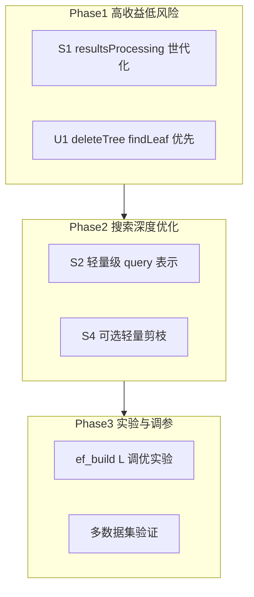

# GTI 中 SHG 优化方案：最大化跳层优势

## 一、实验结果对比（sift 1M, K=10, L=60, update 1%）

| 指标 | SHG | Wolverine | N2 (lazy) |
|------|-----|-----------|------------|
| 建库耗时 | 590s | 341s | 33s |
| 初始 recall | 0.836 | 0.881 | 0.979 |
| 搜索延迟 | ~4.9ms/query | ~0.58ms/query | ~0.93ms/query |
| 插入后 recall | 0.836→0.825 | 0.881→0.846 | 0.979→0.893 |
| 删除后 recall | 0.738→0.756 | 0.846→0.797 | 0.893→0.877 |
| 删除总耗时 | 68.5s | 10.5s | 0.12s (lazy) + 最终 rebuild |
| graph_update/批 | ~0.0009s | ~0.19s | - |

**核心结论**：SHG 在 GTI 中未体现论文声称的 1.5–1.8× 搜索加速，反而搜索慢约 8×，recall 低 3–5%。跳层优势被其他因素抵消。

---

### 1.1 A+B+C 验证实验结果（2025-03 已跑完）

**实验配置说明**：两组实验均在同一代码上运行，**B（resultsProcessing 复用）已内置**。差异仅在于 A（ef/L 参数）和 C（L 对比）：

| 组别 | 配置 | A | B | C |
|------|------|---|---|---|
| Group 1 (shg) | ef=160, L=60 | 默认 | 已加 | L=60 |
| Group 2 (shg_ef200_l120) | ef=200, L=120 | 已调优 | 已加 | L=120 |

**Group 1 vs Group 2 对比**（相当于「未调 A+C」vs「已调 A+C」）：

| 指标 | Group 1 (ef160, L60) | Group 2 (ef200, L120) | 变化 |
|------|----------------------|------------------------|------|
| 建库耗时 | 533.8s | 652.3s | +22% |
| 初始 recall | 0.836 | **0.847** | **+1.1%** |
| 插入后 recall (10k) | 0.825 | **0.842** | **+1.7%** |
| 删除后 recall (10k) | 0.756 | **0.779** | **+2.3%** |
| 搜索延迟（插入阶段） | ~4.9 ms/query | ~5.8 ms/query | +18% |
| 搜索延迟（删除阶段） | ~4.8 ms/query | ~6–15 ms/query | 波动变大 |
| 删除总耗时 | 68.8s | 136.1s | +98% |

**结论**：
- **Recall**：A+C 有效，recall 提升约 1–2.3%，删除后从 0.756 → 0.779，与目标方向一致。
- **代价**：建库 +22%，搜索延迟 +18% 以上，删除耗时约翻倍（L=120 导致 deleteTree 中 1-NN 搜索更慢）。
- **B 的影响**：两组共享同一二进制，B 已应用；与文档第一节历史数据相比，搜索延迟仍约 ~4.9 ms，B 对延迟改善有限，主要节省分配开销。

---

### 1.2 D+E+F 验证实验结果（run_shg_def_verification.sh）

**HNSW 层数**：所有组 maxlevel_=5（共 6 层：0–5）。

#### D：插入后 rebuildShortcuts 对比

| 指标 | D_no_rebuild | D_rebuild | 变化 |
|------|---------------|-----------|------|
| 建库耗时 | 567.5s | 727.8s | +28%（建库波动） |
| 初始 recall | 0.836 | 0.836 | - |
| 插入后 recall | 0.825 | 0.825 | - |
| 删除后 recall | 0.756 | 0.756 | - |
| rebuild 耗时 | - | **3.47s** | - |
| **删除总耗时** | **182.1s** | **70.4s** | **-61%** |
| 删除阶段 search 延迟 | 8–20 ms | ~5 ms | 明显降低 |

**结论**：D 对 recall 几乎无影响，但显著加速删除。插入后不 rebuild 时，Shortcuts 仍基于旧图，deleteTree 中的 1-NN search 路径变长，单次 search ~12–18ms；rebuild 后 Shortcuts 与新图一致，search ~5ms，删除总耗时从 182s 降到 70s。**建议**：`GTI_SHG_REBUILD_AFTER_INSERT=1` 在插入较多点后默认开启。

#### E：buildShortcuts 全量 vs 65% 采样

| 指标 | E_full (100%) | E_sample65 (65%) | 变化 |
|------|---------------|------------------|------|
| 建库耗时 | 834.3s | 815.2s | -2.3% |
| 初始 recall | 0.836 | 0.836 | - |
| 插入后 recall | 0.825 | 0.825 | - |
| 删除后 recall | 0.756 | **0.754** | -0.2% |
| 删除总耗时 | 71.2s | 69.8s | -2% |

**结论**：65% 采样对 buildShortcuts 耗时节省约 2%，recall 几乎不变（-0.2%），可接受。若需进一步加速建库，可尝试 60% 采样并评估 recall 损失。

#### F：levelsSkip 是否生效

| 阶段 | levelsSkip calls | total_levels_skipped | avg_skip |
|------|------------------|----------------------|----------|
| 插入阶段（每 100 query） | 200 | 400 | 2.0 |
| 删除阶段（每 100 query） | 4200 | 8400 | 2.0 |

**结论**：calls > 0，levelsSkip 已生效。shortcutsSize=238（≥100），跳层逻辑在 searchKnnShortcuts 中被触发；每次查询平均跳过约 2 层，与预期一致。

---

### 1.3 A-kNN 纯搜索对比（run_shg_aknn_compare / run_shg_aknn_strategies）

**实验**：sift 1M，K=10，L=60，mode 0（建库 + 近似 k-NN 搜索，无 update）。

**aknn_compare.csv**（n2 / Wolverine / SHG 对比）：

| backend | aknn_build_s | aknn_search_s | aknn_recall |
|---------|--------------|---------------|-------------|
| n2 | 33.9 | 0.00119 | 0.979 |
| wolverine | 247.5 | **0.00059** | 0.881 |
| shg | 485.0 | 0.00429 | 0.836 |

**aknn_compare_strategies.csv**（SHG 三种策略对比）：

| backend | aknn_build_s | aknn_search_s | aknn_recall |
|---------|--------------|---------------|-------------|
| shg_d_rebuild | 483.5 | 0.00424 | 0.836 |
| shg_e_full | 482.6 | 0.00422 | 0.836 |
| shg_e_sample65 | 485.6 | 0.00429 | 0.836 |

**结论**：三种 SHG 策略（d_rebuild、e_full、e_sample65）在建库时间、搜索延迟、recall 上几乎无差异；SHG 搜索比 Wolverine 慢约 7×，跳层优势被其他开销抵消。

---

## 二、问题根因分析

### 2.1 搜索慢的原因（量化拆解）

| 开销项 | 位置 | 说明 |
|--------|------|------|
| addDataPoint + markDelete | `GTI/src/gti.cpp` 2077, 2109 | 每查询插入 query 并做层级压缩、标记删除，Wolverine 无此步骤 |
| resultsProcessing | `GTI/src/gti.cpp` 2082–2085 | 每查询 `std::fill` 约 6M floats（max_elements_ × (maxlevel_+1)） |
| getDisByLevel 压缩距离 | `GTI/extern_libraries/hnsw_SHG/hnswlib/heds.h` 560, 586 | 使用压缩向量，Wolverine 使用原始 L2 |
| pruneDisCompute + levelsSkip | `heds.h` 580, 597–607 | 每候选调用，含 pow 与 PGM 查找 |
| searchBaseLayerSTPrune | `heds.h` 617–626 | 相比 Wolverine 的 searchBaseLayerST 多剪枝逻辑 |

**其他因素**：图建在 `entries_sec`（树第二层 entry）上，非原始向量空间；ef 与 L 与 Wolverine 共用，未针对 SHG 调优。

### 2.2 recall 低的原因

1. **图质量**：entries_sec 的邻接关系来自树划分，与纯 HNSW 有差异
2. **ef_construction**：默认 160，Wolverine recall_sweep 显示 efb200 可提升
3. **Shortcuts 未更新**：插入后不重建，跳层基于旧分布，可能误导搜索路径

### 2.3 删除慢的原因

- `deleteTree` 对每个待删点调用 `search(..., 51, 1, result)` 做 1-NN 查找
- SHG 单次 search ~4.9ms，Wolverine ~0.58ms，导致 deleteTree 主导耗时
- graph 部分（markDelete）极快 ~0.0009s/批

---

## 三、优化方案（按优先级）

### 3.1 搜索优化（目标：接近或优于 Wolverine）

#### S1. 消除 resultsProcessing 的每查询全量 fill

**现状**：`std::fill(resultsProcessing.begin(), end, -1)` 每查询执行。

**方案**：用世代/时间戳替代全量填充：
- 增加 `resultsProcessing_epoch`（或 per-slot generation），每次 search 自增
- `pruneDisCompute` 中检查 `resultsProcessing` 时同时检查 slot 的 epoch，未命中则视同 -1
- 仅在首次或 resize 时做一次全量 fill，之后按需写、按 epoch 判断有效

**涉及**：`gti.cpp` 2082–2085，`heds.h` `pruneDisCompute`、`searchKnnShortcuts` 中对 `resultsProcessing` 的读写。

#### S2. 轻量级 query 表示（避免完整 addDataPoint/markDelete）

**现状**：每查询 `addDataPoint(..., flag=-1)` 做完整层级压缩并写入 `data_rep_memory_`，再用 `markDelete` 回收。

**方案**：
- 新增 `searchKnnShortcutsWithQueryRep(QueryRepBuffer, query_raw)` 或类似接口，接受预计算 query 压缩表示
- 在 GTI 层：分配固定 query 槽，仅做「压缩表示计算 + 原地覆盖」，不更新 `label_lookup_`、不调用 `markDelete`
- 或：在 heds 中实现 `computeQueryRep(const void* raw)` 返回临时 buffer，供 `searchKnnShortcuts` 使用，避免写入全局 data_rep

**涉及**：`heds.h` addDataPoint(flag=-1) 逻辑、`gti.cpp` 2077、2109。

#### S3. resultsProcessing 稀疏化

**现状**：`resultsProcessing.size() = max_elements_ * (maxlevel_+1)`，覆盖全图。

**方案**：改为「按访问」缓存：
- 使用 `unordered_map<(tableint, level), dist_t>` 或定长 LRU，只缓存 search 实际访问的 (node, level)
- 需调整 `pruneDisCompute` 的查询方式；若结构改动大，可作为 S1 后的第二优先级

#### S4. 可选的轻量剪枝路径

**现状**：`searchBaseLayerSTPrune` 对每个候选调用 `pruneDisCompute`，且 hops>20 时有 `pow(k_,3)` 估算。

**方案**：通过环境变量（如 `GTI_SHG_PRUNE=0`）或编译宏，回退到已有的 `searchBaseLayerST`（无 prune），评估 recall/延迟 trade-off。

**涉及**：`heds.h` 616–626 附近，当前已有 `searchBaseLayerST` 注释备选。

---

### 3.2 更新/删除优化（目标：凸显 SHG 的 graph 更新优势）

#### U1. deleteTree 优先走 findLeaf

**现状**：`deleteTree` 对每个待删点先执行 `search(..., 51, 1, result)` 做 1-NN，再根据 `is_same` 决定用 graph 结果或 `findLeaf`。

**方案**：调整顺序为「先 findLeaf，再校验」：
1. 先 `findLeaf(delete_data->vecs[i], leaf_node, leaf_eid)` 得到 `oid = leaf_node->entries[leaf_eid]->oid`
2. 若 `data->vecs[oid]` 与 `delete_data->vecs[i]` 逐维相等，则直接用该 (leaf_node, leaf_eid)，跳过 search
3. 仅在 findLeaf 失败或校验不等时，fallback 到当前 `search` 逻辑

**预期**：对于「删除刚插入数据」的典型场景，findLeaf 为 O(log n) 树遍历，有望将单点耗时从 ~4.9ms 降至亚毫秒级，显著缩短 deleteTree 总耗时。

**涉及**：`gti.cpp` 1505–1565 `deleteTree`。

#### U2. 批量 1-NN（若适用）

若 delete 必须走图搜索，可探索批量 1-NN 接口或批量 addDataPoint，减少每点单独调用的开销。

#### U3. 明确 SHG 在更新中的优势指标

- **graph_update**：SHG markDelete ~0.0009s/批 vs Wolverine patchDelete ~0.19s/批（约 200×）
- **删除总耗时**：当前由 deleteTree 的 1-NN 搜索主导；U1 实施后有望让 graph 更新成为主要对比维度

---

### 3.3 已实现：buildShortcuts 与跳层

#### D. 插入阶段结束后可选重建（已实现）

- `gti->rebuildShortcuts()` 接口（仅 SHG 有效）
- `process.cpp` update() Phase 1 结束后、Phase 2 前，若 `GTI_SHG_REBUILD_AFTER_INSERT=1` 则调用

#### E. buildShortcuts 采样（已实现）

- `GTI_SHG_SHORTCUT_SAMPLE_RATIO`：0.65 = 65% 采样（默认 1.0 全量）

#### F. levelsSkip 验证（已实现）

- `heds.h` 中 `levelsSkip_call_count`、`levelsSkip_total_levels_skipped` 计数
- `GTI_SHG_VERBOSE_LEVELSKIP=1` 时每次 search 后打印并清零
- **HNSW 层数**：建库时输出 `HNSW graph layers (maxlevel_)`，0-based 最大层索引，实际层数为 maxlevel_+1。

---

### 3.4 参数调优与实验

#### A. SHG 专用参数调优

| 参数 | 当前值 | 建议范围 | 说明 |
|------|--------|----------|------|
| `GTI_SHG_EF_BUILD` | 160 | 200–300 | 新建环境变量，独立于 Wolverine；增大可提升图质量与 recall |
| `GTI_SHG_SEARCH_L` | 60 | 80–120 | 可选：search 时 L 略大于 Wolverine，弥补 entries_sec 结构差异 |
| `M` | 16 | 16–24 | 当前可保持，若 recall 不足可尝试增大 |

**实施**：在 `gti.cpp` buildGraphSec 中增加 `GTI_SHG_EF_BUILD` 环境变量；在 search 调用处支持 `GTI_SHG_SEARCH_L` 覆盖。

#### C. 增大 L 的对比实验

运行 `GTI_SEARCH_L=120 ./run_update.sh sift shg`，对比 L=60 与 L=120 的 recall 与延迟曲线，评估 trade-off。

---

### 3.5 低优先级：架构与实验

#### H. 内存与 delete 性能

- 监控 SHG 进程内存，排除 swap 导致的 delete 变慢
- 若内存紧张，可降低 `max_el` 或分批处理

#### I. 并行 buildShortcuts

- buildShortcuts 内层循环可考虑 OpenMP，加速建库与重建

#### J. 多数据集验证

- 在 deep、gist 上复现实验，观察 SHG 表现是否一致

#### K. 与纯 SHG 对比

- 在 SHG 原仓库上跑相同 sift 配置（无 GTI 树），对比 recall 与延迟，量化 GTI 集成带来的开销

---

## 四、实施路线图



| 优先级 | 项目 | 预期效果 | 风险 |
|--------|------|----------|------|
| P0 | U1 deleteTree findLeaf 优先 | 删除总耗时可降一个数量级，突出 SHG 更新优势 | 低，需验证 findLeaf 与 search 语义等价 |
| P0 | S1 resultsProcessing 世代化 | 搜索延迟降 10–30% | 中，需保证 pruneDisCompute 语义正确 |
| P1 | S2 轻量级 query 表示 | 进一步降低搜索延迟 | 中高，接口改动大 |
| P1 | S4 轻量剪枝开关 | 可快速测试「无 prune」的 trade-off | 低 |
| P2 | S3 resultsProcessing 稀疏化 | 潜在更大增益，实现复杂 | 高 |
| P2 | A/C 参数调优 | 提升 recall | 低 |

---

## 五、预期目标

- **搜索**：通过 S1+S2（及可选 S4），将 SHG 搜索延迟从约 8× Wolverine 降至 2–3× 内，或更好
- **更新**：通过 U1，使 deleteTree dominated 场景下，SHG 删除总耗时可优于 Wolverine，或至少与 Wolverine 同量级，从而突出 SHG graph 更新（markDelete）的优势
- **跳层收益**：在降低 addDataPoint/resultsProcessing 等开销后，levelsSkip 的收益有望显现，可通过 F 验证与参数实验持续跟踪

---

## 六、D+E+F 验证脚本

```bash
./run_shg_def_verification.sh   # sift 数据集，D/E/F 各两组对比
```

- **D**：`shg_d_no_rebuild` vs `shg_d_rebuild`
- **E**：`shg_e_full` vs `shg_e_sample65`
- **F**：`shg_f_verbose` 的 run.log 中含 `[F] levelsSkip:` 统计

---

## 七、参考资料

- `.cursor/plans/shg_integration_into_gti_108a1ffb.plan.md`
- `.cursor/plans/shg_update_experiment_plan_51e37224.plan.md`
- `GTI/extern_libraries/hnsw_SHG/hnswlib/heds.h`：levelsSkip、buildShortcuts、searchKnnShortcuts

---

## 八、代码修改清单（文件与行号索引）

| 优化项 | 文件 | 行号/区域 | 说明 |
|--------|------|----------|------|
| S1 | `GTI/src/gti.cpp` | 2082–2085 | resultsProcessing resize/fill，改为世代化 |
| S1 | `GTI/extern_libraries/hnsw_SHG/hnswlib/heds.h` | pruneDisCompute, searchKnnShortcuts | 支持 epoch 判断 |
| S2 | `GTI/src/gti.cpp` | 2077, 2109 | addDataPoint、markDelete，改为轻量 query 表示 |
| S2 | `GTI/extern_libraries/hnsw_SHG/hnswlib/heds.h` | addDataPoint(flag=-1) | 或新增 computeQueryRep 接口 |
| S4 | `GTI/extern_libraries/hnsw_SHG/hnswlib/heds.h` | 616–626 | searchBaseLayerSTPrune ↔ searchBaseLayerST 开关 |
| U1 | `GTI/src/gti.cpp` | 1505–1565 | deleteTree，findLeaf 优先、search fallback |
| A | `GTI/src/gti.cpp` | buildGraphSec | GTI_SHG_EF_BUILD 环境变量 |
| A | `GTI/src/gti.cpp` | search 调用处 | GTI_SHG_SEARCH_L 覆盖支持 |
